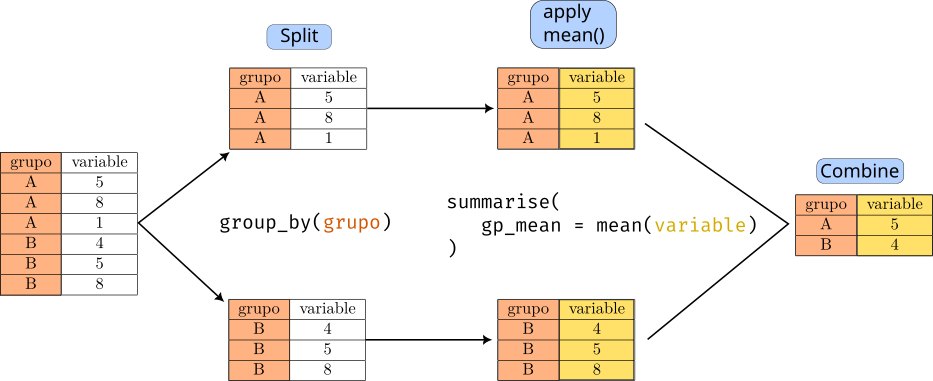

# Análisis Estadístico Multivariable

## Temas

1. Variables aleatorias multivariadas
   1. Correlaciónes y covarianzas

2. Modelos de distribución multivariados
   1. Funciones de distribución y densidad
   2. Distribucion multinormal

3. Teoría de la estimación
   1. Función de verosimilitud
   2. Prueba de verosimilitud
   3. Prueba de hipótesis lineal (regresión lineal)
   4. Regresión logística

4. Técnicas multivariadas
   1. ANOVA, MANOVA, ANCOVA
   2. Modelos log-lineal
   3. Selección de variables

5. Descomposición de datos y técnicas de análisis
   1. Análisis de componentes principales
   2. Análisis factorial
   3. Análisis de clúster
   4. Análisis discriminante

6. Aplicaciones

## Bibliografía

- *Applied Multivariate Statistical Analysis*. Wolfgang H. and Simar. L. Springer, 2015
- *Applied Multivariate Statistical Concepts*. Hahs-Vaughn, D. Editorial Routledge, 2016.
- *Applied Multivariate Statistics with R*. Zelterman, D. Editorial Springer, 2015.

## Datasets

- [RDatasets](https://vincentarelbundock.github.io/Rdatasets/articles/data.html)
- [The Humanitarian Data Exchange](https://data.humdata.org/)
- [TidyTuesday](https://github.com/rfordatascience/tidytuesday)
- [Openpsychometrics](https://openpsychometrics.org/_rawdata/)

## Tutoriales

### `R` básico

Existen muchos tutoriales básicos de R. Estos son algunos de mis favoritos:

- [Data Carpentry: Intro to R](https://datacarpentry.org/R-genomics/01-intro-to-R.html)
  - Comenzar [aquí](https://datacarpentry.org/R-genomics/00-before-we-start.html).
- [Data Carpentry: Starting with data](https://datacarpentry.org/R-genomics/02-starting-with-data.html)
- [Data Carpentry: Data frames](https://datacarpentry.org/R-genomics/03-data-frames.html)

Al ser básicos, no enseñan algunas cosas avanzadas tales como construir nuestras propias funciones, control de flujo (ciclos `for` o `while`, enunciados con `if-else`, etc.).

Para una introducción básica a esto, revisar el tutorial

- [`R: control de flujo y funciones`](R_tutorials/r_flujo_funciones.ipynb). Notar que está en forma de jupyter notebook. El código en las celdas se puede copiar a un script de R.

### Data wrangling con `{dplyr}` y `{tidyr}`

En la [`esta`](R_tutorials/data_wrangling_dplyr.ipynb) notebook se encuentra un tutorial sencillo de *data wrangling* usando los paquetes de `{dplyr}` y `{tidyr}`. Se cubren aspectos como transformación, enriquecimiento y limpieza de tal forma que tengamos un estándar llamado `tidy data`.

### Visualización con `{ggplot}`

### Modelamiento con `{tidymodels}`

- [recipes]
- [parsnip]:
  - Regresión lineal
    - The MLW way
    - The OLS way
  - ANOVA

